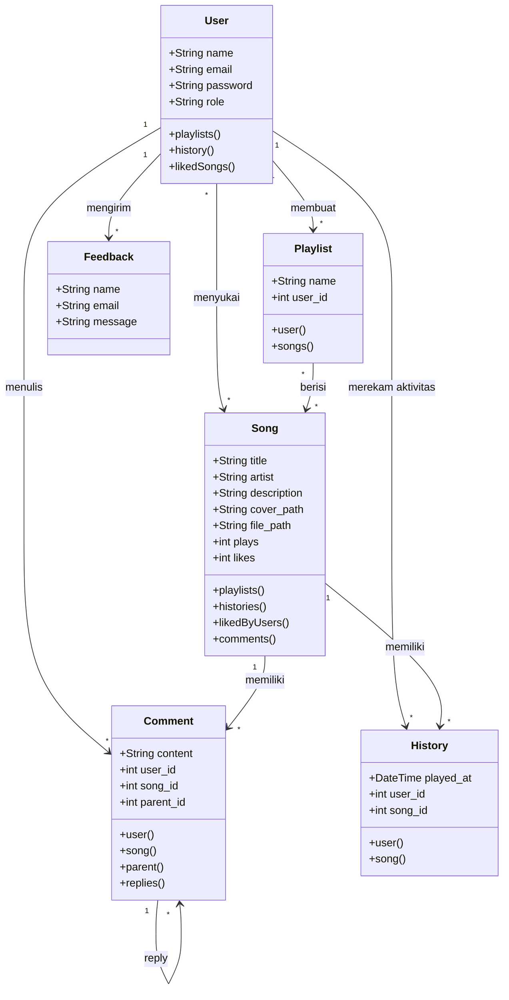

# UKM Band - Mobile Music Platform, Laravel API, and Firebase Backend

[](https://github.com/Ashlxxy/Tubes-APB)
[](https://github.com/Ashlxxy/Tubes-APB)

Repository ini berisi kode sumber lengkap untuk **UKM Band Music Streaming Platform**, platform musik digital khusus Unit Kegiatan Mahasiswa Band Universitas Telkom. Proyek ini terdiri dari aplikasi mobile Flutter, web portal dan REST API Laravel, serta mode backend Firebase untuk aplikasi mobile.

---

## Firebase Mobile Backend

Aplikasi mobile Flutter sudah memiliki mode backend Firebase yang bisa diaktifkan tanpa menghapus mode lokal dan Laravel REST API. Firebase dipakai untuk autentikasi user, data musik, playlist, riwayat putar, like, dan komentar. Firebase Storage tidak dipakai karena layanan tersebut berbayar.

<table align="center">
  <tr>
    <td align="center" width="50%">
      <br/>
      <b>Alur Mobile ke Firebase</b>
    </td>
    <td align="center" width="50%">
      <br/>
      <b>Contoh Struktur Firestore</b>
    </td>
  </tr>
  <tr>
    <td align="center" colspan="2">
      <br/>
      <b>Peta Source Implementasi Firebase</b>
    </td>
  </tr>
</table>

### Bentuk Source Firebase

| File | Fungsi |
| :--- | :--- |
| `ukm_band_mobile/lib/firebase_config.dart` | Membaca konfigurasi Firebase dari `--dart-define`. |
| `ukm_band_mobile/lib/main.dart` | Inisialisasi Firebase saat `USE_FIREBASE=true`. |
| `ukm_band_mobile/lib/services/api_service.dart` | Memilih backend aktif: lokal, Laravel REST API, atau Firebase. |
| `ukm_band_mobile/lib/services/firebase_backend_service.dart` | Menangani Firebase Auth dan Cloud Firestore. |
| `ukm_band_mobile/docs/firebase.md` | Dokumentasi alur data, struktur collection, dan cara menjalankan mode Firebase. |

### Data yang Terhubung ke Firebase

| Firebase | Data Aplikasi Mobile |
| :--- | :--- |
| Firebase Auth | Register, login, logout, dan session user. |
| Cloud Firestore `users` | Profil user, role, dan email. |
| Cloud Firestore `songs` | Lagu, cover path, audio path, plays, likes, dan jumlah komentar. |
| Cloud Firestore `playlists` | Playlist user dan daftar `song_ids`. |
| Cloud Firestore `histories` | Riwayat lagu yang diputar user. |
| Cloud Firestore `likes` | Status like per user per lagu. |
| Cloud Firestore `comments` | Komentar dan reply pada lagu. |

Menjalankan mobile app dengan Firebase:

```bash
cd ukm_band_mobile
flutter run ^
   --dart-define=USE_FIREBASE=true ^
   --dart-define=FIREBASE_API_KEY=your-api-key ^
   --dart-define=FIREBASE_APP_ID=your-app-id ^
   --dart-define=FIREBASE_MESSAGING_SENDER_ID=your-sender-id ^
   --dart-define=FIREBASE_PROJECT_ID=your-project-id
```

Dokumentasi lengkap: [`ukm_band_mobile/docs/firebase.md`](ukm_band_mobile/docs/firebase.md)

---

## Tampilan Aplikasi Mobile Flutter

Berikut tampilan antarmuka aplikasi mobile Flutter dengan tema premium dark glassmorphism dan aksen crimson.

<table align="center">
  <tr>
    <td align="center" width="33%">
      <br/>
      <b>Detail Lagu dan Pemutar</b>
    </td>
    <td align="center" width="33%">
      <br/>
      <b>Profil Saya</b>
    </td>
    <td align="center" width="33%">
      <br/>
      <b>Edit Profil</b>
    </td>
  </tr>
  <tr>
    <td align="center" width="33%">
      <br/>
      <b>Widget Kartu Lagu</b>
    </td>
    <td align="center" width="33%">
      <br/>
      <b>Kolom Komentar</b>
    </td>
    <td align="center" width="33%">
      <br/>
      <b>Tentang Aplikasi</b>
    </td>
  </tr>
</table>

---

## Tampilan Portal Web Laravel

Website UKM Band memakai desain glassmorphism yang serasi dengan tema aplikasi mobile.

<table align="center">
  <tr>
    <td align="center" width="50%">
      <br/>
      <b>Landing Page</b>
    </td>
    <td align="center" width="50%">
      <br/>
      <b>Portal Login</b>
    </td>
  </tr>
  <tr>
    <td align="center" width="50%">
      <br/>
      <b>Detail Lagu dan Komentar</b>
    </td>
    <td align="center" width="50%">
      <br/>
      <b>Pemutar Musik Aktif</b>
    </td>
  </tr>
</table>

---

## Struktur Repositori

- `backend/`: aplikasi backend Laravel 12 sebagai web portal dan REST API.
- `ukm_band_mobile/`: aplikasi mobile Flutter dengan Provider state management.
- `docs/screenshots/`: screenshot tampilan mobile dan web.
- `docs/firebase/`: visual contoh alur Firebase, struktur Firestore, dan peta source Firebase.

---

## Kredensial Akun Default

| Peran | Email | Password | Keterangan |
| :--- | :--- | :--- | :--- |
| Administrator | `admin@ukmband.telkom` | `admin123` | Akses penuh dashboard admin web portal, ditolak pada aplikasi mobile. |
| User Demo | `user@example.com` | `password` | Akses streaming lagu, playlist, dan komentar. |

---

## Instalasi Lokal

### Web Portal dan REST API Laravel

Persyaratan:

- PHP >= 8.2 dengan ekstensi `pdo_sqlite`
- Composer
- Node.js dan npm

Langkah:

```bash
cd backend
composer install
npm install
cp .env.example .env
php artisan key:generate
php artisan migrate:fresh --seed
php artisan storage:link
npm run build
php artisan serve
```

Portal web berjalan di `http://127.0.0.1:8000`, sedangkan REST API berjalan di `http://127.0.0.1:8000/api`.

### Aplikasi Mobile Flutter

Persyaratan:

- Flutter SDK
- Android Studio atau VS Code dengan plugin Flutter
- Emulator Android atau perangkat fisik

Langkah:

```bash
cd ukm_band_mobile
flutter pub get
flutter run
```

Endpoint REST API default untuk emulator Android adalah `http://10.0.2.2:8000/api`. Untuk perangkat fisik, gunakan IP lokal komputer server backend.

---

## Diagram Relasi Database Laravel



---

Dibuat oleh Kelompok 2 WebPro untuk Tubes-APB.
